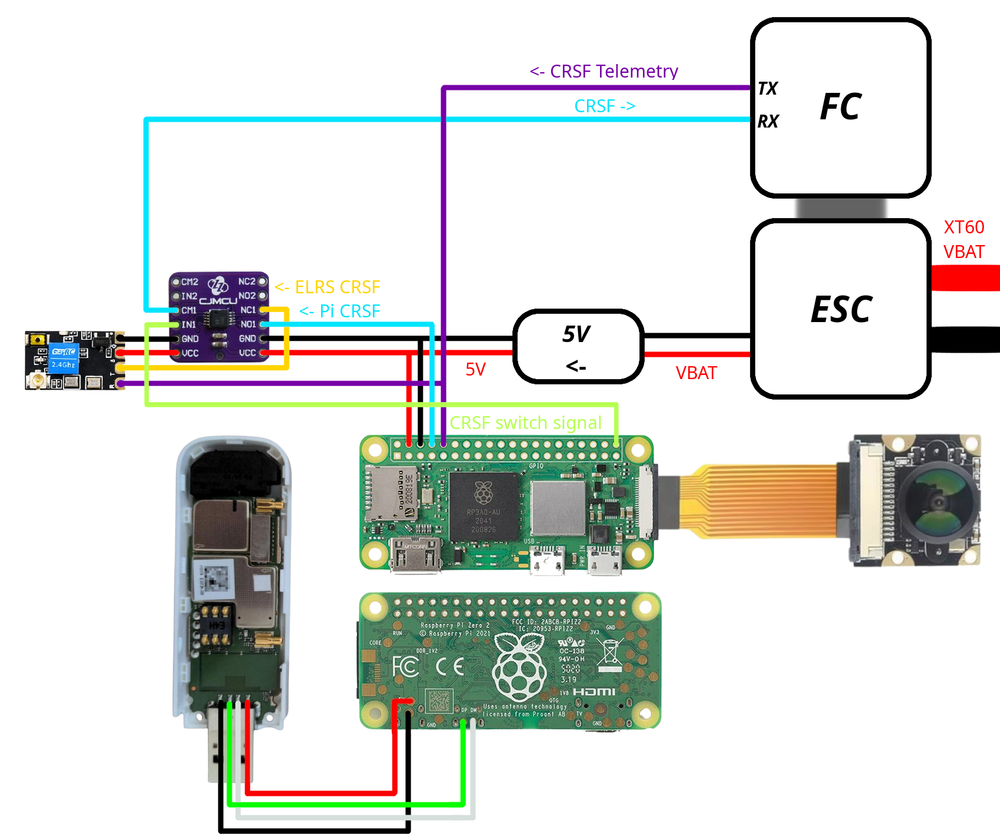

# FPV Drone over 4G (Masina V3)
## Overview

This guide provides detailed instructions on how to build a FPV drone capable of long range flight using a combination of 4G connectivity and/or ELRS radio control. The drone transmits live video feed to a computer over the 4G network with approximately 100ms latency. Operate it using standard Xbox or PlayStation controllers. The system also includes on-screen display (OSD) information, live GPS tracking, and safe handling features in case of a connection loss.

>ELRS (ExpressLRS) is an open-source, low-latency, long-range radio control system popular in FPV drones for its reliability and performance.

## Features
* **Dual Control:** Control a drone using either an ELRS transmitter for local control or a 4G modem for remote control.
* **Low Latency Video:** Real time video transmission with minimal delay (100ms).
* **Safe connection disruptions handling**: Hover then Land/Return to launch.
* **Real time GPS Tracking:** Track drone location live using a Traccar server.
* **Backup GPS Tracking via SMS:** Track drone location using SMS commands, in case of loss of signal/electronics failure.
* **Extended Range:** Achieve significantly greater range through 4G compared to traditional radio control.
* **On screen display (OSD):** Telemetry data overlaid on the video feed, including: **Battery Level, Compass, GPS Coordinates, Speed**.

### Explanation
A Raspberry Pi communicates with a remote server (PC) using UDP sockets, relaying Crossfire (CRSF) telemetry data from the flight controller to the server. A server (PC) reads the positions of analog sticks (thrust, pitch, roll, and yaw) from a controller and sends this information to the Raspberry Pi. The Pi then encodes the received data into valid Crossfire protocol frames and sends them to the flight controller via the serial port. On the PC, telemetry data is decoded and parsed from the Crossfire telemetry frames, overlaying this information onto a video window. The system includes safety mechanisms such as CRC-based error detection, reconnection protection, and out-of-order data handling. If the connection is lost for more than 250 ms, the drone stabilizes, and if the connection is not reestablished within 10 seconds, the drone either lands or returns to its launch point, according to the user's settings.

## Videos
#### [Successful 20km drone flight | FPV over 4G - YouTube](https://youtu.be/IMyPImF74hA)
[](https://youtu.be/IMyPImF74hA "20km flight")

#### [13km flight, working almost too well | FPV over 4G - YouTube](https://youtu.be/IEeil4s7mzk)
[](https://youtu.be/IEeil4s7mzk "13km flight")

#### [Full control + video over 4G FPV - YouTube](https://youtu.be/Cio6WwT3rgs)
[](https://youtu.be/Cio6WwT3rgs "Full control + video over 4G FPV")

#### [Variable bitrate in action | FPV over 4G - YouTube](https://youtu.be/rRw1hKG7MNs)
[](https://youtu.be/rRw1hKG7MNs "Variable bitrate")

## Legal Compliance Notice:
***Before operating your FPV drone, it is crucial to check and comply with all local laws and regulations related to drone usage, especially those concerning airspace, privacy, and the use of wireless communication systems. Ignoring these laws can lead to serious legal consequences, including fines or other penalties. Always ensure that your drone operations are within the boundaries of the law to promote safe and responsible flying.***

## Images


## Prerequisites
* Make sure you have access to your router's port forwarding settings.
* Stable internet connection at home.
* Reliable 4G coverage, internet speed 200kB/s and more recommended.
* SIM card with enough data.
* Configured betaflight on your drone.
* [GStreamer](https://gstreamer.freedesktop.org/download) installed on your system (MSVC 64-bit runtime and development) and Visual Studio.
* Intermediate soldering knowledge.

## Tools
* Soldering iron
* 3D printer or cardboard, tape and hotglue
* Li-ion spotwelder - Needed if you plan to create your own battery pack.
* Screwdriver and Hexagon Allen Keys
* Wires
* SD card reader

## Hardware
1. Drone
    1. [Mark4 7-inch clone frame](https://www.aliexpress.com/item/1005006288716729.html) - 16€
    2. [FPVKING X2807 2807 1300KV](https://www.aliexpress.com/item/1005006401886065.html) / [Eachine Tyro129 2507 1800KV](https://www.aliexpress.com/item/1005004629318899) - 35€
    3. [F4 Flight Controller + 60A ESC](https://www.aliexpress.com/item/1005005595770342.html) - 50€
    4. [HQPROP 7X4X3 7040](https://www.aliexpress.com/item/1005007190275766.html) / [Dalprop Racerstar CYCLONE T7056C](https://www.aliexpress.com/item/1005001565618746.html) - 5€ for 2pairs
    5. (optional although, highly recommend) [M10 GPS](https://www.aliexpress.com/item/1005006454375770) - 16€
    6. probably some M3 screws
2. Raspberry Pi Zero 2W - 18€
3. Huawei E3372 4G usb modem - 30€ (used)
4. [Raspberry Camera V1 IR](https://www.aliexpress.com/item/1005003386791483.html) 160° - 8€ / 130° - 5€
5. [8cm Raspberry Pi zero camera cable](https://www.aliexpress.com/item/1005002969357117.html) - 1€
6. [5V buck converter](https://www.aliexpress.com/item/32905033708.html) - 2€
7. xbox/playstation/fpv controller
8. 4S/5S Battery pack - buy (40-90€) or diy
    1. [Samsung INR21700-40T (40T3) 4000mAh - 35A](https://eu.nkon.nl/rechargeable/li-ion/21700-20700-size/samsung-inr21700-40t-40t3-4000mah-35a-reclaimed.html) 3,85€/cell
    2. [Sanyo NCR2070C 20700 3620mAh - 30A](https://eu.nkon.nl/sanyo-ncr2070c-clear.html) 3,45€/cell
    3. [Molicel INR21700-P45B 4500mAh - 45A](https://eu.nkon.nl/molicel-inr21700-p45b-4500mah-45a.html?gad_source=1&gclid=CjwKCAjw8fu1BhBsEiwAwDrsjMbNsElHF3OUJdrsFNVPzGd-a7uBI8tSW-Qr7JhOOwf1EgZ946oXIRoClEEQAvD_BwE) - 6,65€/cell
    4. [**Pure** nickel stripes 5x0.2mm or 5x0.1/0.12mm](https://www.aliexpress.com/item/1005005509648053.html)
    5. [XT60 cable](https://www.aliexpress.com/item/1005006020931792.html?spm=a2g0o.order_list.order_list_main.107.5dc71802m9YITy) - 1€
    6. [balance connector](https://www.aliexpress.com/item/1005003768479001.html?spm=a2g0o.order_list.order_list_main.52.157c1802qMqatu) - 1€
    7. [21700 cell plastic holder](https://www.aliexpress.com/item/1005005581981633.html?spm=a2g0o.order_list.order_list_main.71.157c1802qMqatu) - 2€ or 3D print
    6. spot welder - 30€
    7. [Fiberglass tape](https://www.aliexpress.com/item/1005003745597544.html)  - 5€ / any other strong tape
9. SIM card with mobile data
10. microSD card  8GB+ 
11. [GPS Tracker for recovery](https://github.com/danielbanar/A9G-GPS-tracker) (optional)
12. 9. ELRS control (optional)
    1. ELRS Receiver - 12€
    2. ELRS Controller (e.g. Radiomaster pocket 2.4GHz 250mW) - 70€
    3. [TS5A23157 Switch Module](https://www.aliexpress.com/item/1005005946760421.html) - 2€

## Schematics


## Setup
### Preparing the SD Card
* Download Raspberry Pi Imager from the [official website](https://www.raspberrypi.com/software/).
* Insert the MicroSD card into your computer's card reader.
* Open Raspberry Pi Imager and select the OS: **Raspberry Pi OS (Legacy 32-bit) Lite**.
* Set your username and password.
* Configure Wi-Fi settings.
* Save your settings and click Write to flash the SD card.
* Eject the SD card and insert it into your Raspberry Pi.


### Preparing the Raspberry Pi
1. Plug the camera to the CSI port.
2. Power it on.
3. SSH into the raspberry pi.
4. Enable the legacy camera interface and serial port using: `sudo raspi-config` and navigate to **Interface Options**
    1. Legacy Camera > Yes
    2. Serial Port > No > Yes
    3. Back > Finish > Yes
5. Update the OS: 
```
sudo apt update && sudo apt upgrade -y
sudo apt-get install git proftpd python3-pip libboost-all-dev build-essential libgstreamer1.0-dev libgstreamer-plugins-base1.0-dev libgstreamer-plugins-bad1.0-dev gstreamer1.0-plugins-base gstreamer1.0-plugins-good gstreamer1.0-plugins-bad gstreamer1.0-plugins-ugly gstreamer1.0-libav gstreamer1.0-tools gstreamer1.0-x gstreamer1.0-alsa gstreamer1.0-gl gstreamer1.0-gtk3 gstreamer1.0-pulseaudio autoconf automake libtool pkg-config libraspberrypi-dev -y
```
6. Reboot: `sudo reboot` and ssh again
7. Install libraries
```
git clone https://github.com/thaytan/gst-rpicamsrc.git
cd gst-rpicamsrc/
./autogen.sh --prefix=/usr --libdir=/usr/lib/arm-linux-gnueabihf/
make
sudo make install
cd

wget http://www.airspayce.com/mikem/bcm2835/bcm2835-1.75.tar.gz
tar -xzvf bcm2835-1.75.tar.gz
cd bcm2835-1.75
./configure
make
sudo make install
cd
```

### Modem Configuration
* Insert the SIM card into the modem.
* Connect the 4G modem to the raspberry pi using microUSB -> USB OTG cable.

#### Method 1: ModemManager
This is the simpler way of connecting to the 4G network, but it doesnt have any reconnect protection.

`sudo crontab -e` -> choose 1 (nano) and to the bottom add: 

`@reboot sleep 30 && sudo mmcli -m 0 --enable && sudo mmcli -m 0 --simple-connect="apn=your_apn,ip-type=ipv4"`
replacing the "your_apn" with your mobile service provider´s access point name.

Save the file by holding `Ctrl+X`, then press `Y`
>To find your provider's access point name insert the SIM card to your phone. And navigate to mobile network settings, here you should find it.

#### Method 2: NetworkManager (recommended)
* If you have usb ethernet adapter and usb hub you can use that to connect the raspberry pi to your network and skip to step: *Edit the NetworkManager config: sudo nano /etc/NetworkManager/NetworkManager.conf*
* If not make a nmconnection file for your wifi, I highly recommend creating separate wifi network just for the drone so you can disable it when not debugging/setting it up, otherwise it might use wifi instead of the 4g modem and you will lose connection when trying to fly somewhere.


Create a new connection file: `sudo nano /etc/NetworkManager/system-connections/debug` and paste, replacing the `ssid` and `psk` with your own:
```
[connection]
id=debug
uuid=f1c34425-a556-4b27-9ed1-0f9dc6bdec74
type=wifi

[wifi]
mode=infrastructure
ssid=debug

[wifi-security]
key-mgmt=wpa-psk
psk=debugpassword

[ipv4]
method=auto

[ipv6]
ip6-privacy=2
method=auto

[proxy]
```
Save the file by holding `Ctrl+X`, then press `Y`

Modify the permissions: `sudo chmod 600 /etc/NetworkManager/system-connections/debug`

Edit the NetworkManager config: `sudo nano /etc/NetworkManager/NetworkManager.conf`

Remove everything and paste:
```
[main]
plugins=ifupdown,keyfile
dhcp=internal

[ifupdown]
managed=true
```
Save the file by holding `Ctrl+X`, then press `Y`

Disable wpa_supplicant and enable NetworkManager:
```
sudo systemctl disable dhcpcd && sudo systemctl disable wpa_supplicant && sudo systemctl enable NetworkManager && sudo reboot &
```
The system will reboot. So ssh back into the raspberry pi.

Now create the connection file for the modem: `sudo nmcli c add type gsm ifname '*' con-name MOBILE apn your_apn connection.autoconnect-priority 20` replacing the `your_apn` with your mobile service provider´s access point name.

>To find your provider's access point name insert the SIM card to your phone. And navigate to mobile network settings, here you should find it.

Check if the modem is active by typing `nmcli` and you should get something like this:
```
ttyUSB0: connected to MOBILE
    "Huawei Mobile Broadband"
wlan0: connected to your_wifi
    "Broadcom BCM43438 combo and Bluetooth Low Energy"
```
### Connecting to home
#### Method 1: PiTunnel (recommended)
* Open https://www.pitunnel.com create an account and follow instrucions.
* Ensure UDP ports 2222-2224 are open on your router.

#### Method 2: WireGuard VPN (use if you have linux server/pc at home)
* Setup WireGuard server on your home network: https://www.pivpn.io
* Open udp port on your router (default: 51820)
* add a client using `pivpn -a drone`
* copy the file to /etc/wireguard/wg0.conf on the raspberry pi using `sudo nano /etc/wireguard/wg0.conf` and add `PersistentKeepalive = 25` at the bottom
Enable the service on raspberry pi:
```
sudo systemctl enable wg-quick@wg0.service
sudo systemctl daemon-reload
sudo systemctl start wg-quick@wg0.service
```

### Setting up Dynamic DNS
Setting up Dynamic DNS (DDNS) allows you to avoid constantly changing the IP address whenever your network restarts. If your router supports DDNS, you can set it up directly. For example, you can create a free account on [No-IP](www.noip.com) and add your login credentials to your router's DDNS settings.

>If your router doesn't support DDNS, look up alternative methods and tutorials online to achieve this.

### Testing

At this point we should have working video stream over 4G.
So let's test it. First make sure we are connected to the 4G network by turning off the wifi network we setup just for this or if you used usb ethernet adapter unplug it.

Open [PiTunnel](https://www.pitunnel.com/devices) devices tab to verify your Raspberry Pi is online.

Click on Open Remote Terminal, enter your Pi's credentials, and run the command sudo nmcli. You should see:
```
ttyUSB0: connected to MOBILE
    "Huawei Mobile Broadband"
```
Enter the following GStreamer command, replacing your_ddns with your DDNS or [public IP address](http://checkip.amazonaws.com): 
`gst-launch-1.0 rpicamsrc bitrate=500000 preview=false ! video/x-h264,width=480, height=360,framerate=30/1 ! h264parse ! rtph264pay config-interval=1 pt=96 ! udpsink host=your_ddns port=2222`


On your computer navigate to your gstreamer folder, the default should be: `C:\gstreamer\1.0\msvc_x86_64\bin` open a terminal here by holding `Shift` and `Right click` and click on Open in Terminal/Open powershell window here.
Paste this command to the terminal: `gst-launch-1.0.exe udpsrc port=2222 ! application/x-rtp,encoding-name=H264,payload=96 ! rtph264depay ! avdec_h264 ! fpsdisplaysink sync=false`
And video window should appear and everything should be working.
>  If nothing opens, check for errors on the Raspberry Pi. Otherwise ensure your firewall isn't blocking the port 2222. If using a third-party antivirus, disable its firewall. Then go to **Windows Defender Firewall with Advanced Security** settings. Now on top left click on Inbound Rules and in the top right click New Rule > Port > UDP, Specific remote ports: 2222-2224 > Allow the connection > name it whatever you like > Finish. Repeat the same in Outbound Rules.

### Autostart video
Here you can choose whether you also want to record the video to a SD card.

#### Stream only
Create the stream service: `sudo nano /etc/systemd/system/cam_stream.service`
```
[Unit]
Description=Camera Stream
After=NetworkManager.service

[Service]
ExecStart=gst-launch-1.0 rpicamsrc rotation=180 bitrate=0 quantisation-parameter=32 preview=false ! video/x-h264,width=480,height=360,framerate=40/1 ! h264parse ! rtph264pay config-interval=1 pt=96 ! udpsink host=your_ddns port=2222
Restart=always
RestartSec=5

[Install]
WantedBy=default.target
```
Save the file by holding `Ctrl+X`, then press `Y`
Enable the service: `sudo systemctl enable cam_stream.service`

#### Stream and record
Create bash script that record the video with time as the filename: `sudo nano stream_and_save.sh`
```
#!/bin/bash

# Generate a timestamp
timestamp=$(date +"%Y%m%d_%H%M%S")

# Define the filename with the timestamp
filename="/home/pi/videos/video_$timestamp.mkv"

# Run the GStreamer pipeline
gst-launch-1.0 rpicamsrc rotation=180 bitrate=0 quantisation-parameter=32 preview=false ! \
    video/x-h264,width=480,height=360,framerate=40/1 ! h264parse ! \
    tee name=t ! \
    queue ! rtph264pay config-interval=1 pt=96 ! udpsink host=your_ddns port=2222 \
    t. ! \
    queue ! matroskamux ! filesink location=$filename

```
Modify the script permissions: `sudo chmod +x stream_and_save.sh`

Create a folder for videos: `sudo mkdir videos`

Create the stream service: `sudo nano /etc/systemd/system/cam_stream.service`
```
[Unit]
Description=Camera Stream
After=NetworkManager.service

[Service]
ExecStart=sh /home/pi/stream_and_save.sh
Restart=always
RestartSec=5

[Install]
WantedBy=default.target
```
Enable the service: `sudo systemctl enable cam_stream.service`

### Controls and telemetry (Pi)
Download the source: `git clone https://github.com/danielbanar/MasinaV3.git`

Enter the folder: `cd client`
Edit the DDNS to yours: `sudo nano client.cpp` by changing the string on this line `#define HOSTNAME "your_ddns"`

Compile it by running: `make`

Create a new service: `sudo nano /etc/systemd/system/client.service`
```
[Unit]
Description=UDP Client
After=NetworkManager.service

[Service]
ExecStart=sudo /home/pi/client/client
Restart=always
RestartSec=5

[Install]
WantedBy=default.target
```

### Controls and telemetry (PC)
Download the repository on your PC and open the solution file in Visual Studio: `pc\UDP_Server\UDP_Server.sln`.

Compile the project, preferably in **Release, x64**.

### Video
Add the gstreamer folder to your PATH environment variable by running this command as an administrator, or wherever you installed it.

`setx PATH "%PATH%;C:\gstreamer\1.0\mingw_x86_64\bin"`

#### Now you have two choices:
1. Run one of these gstreamer commands: 
```
-No frame info
gst-launch-1.0.exe udpsrc port=2222 ! application/x-rtp,encoding-name=H264,payload=96 ! rtph264depay ! avdec_h264 ! autovideosink sync=false

-With frame info
gst-launch-1.0.exe udpsrc port=2222 ! application/x-rtp,encoding-name=H264,payload=96 ! rtph264depay ! avdec_h264 ! fpsdisplaysink sync=false

-Frame info with scaled font (change the resolution to your own)
gst-launch-1.0.exe udpsrc port=2222 ! application/x-rtp,encoding-name=H264,payload=96 ! rtph264depay ! avdec_h264 ! videoscale ! video/x-raw,width=1280,height=960 ! fpsdisplaysink sync=false
```
2. Create a executable by compiling the solution: `pc\UDP_Server\UDP_Video.sln`.


## Troubleshooting
[Discord](https://discord.gg/Z7jq2a89)
